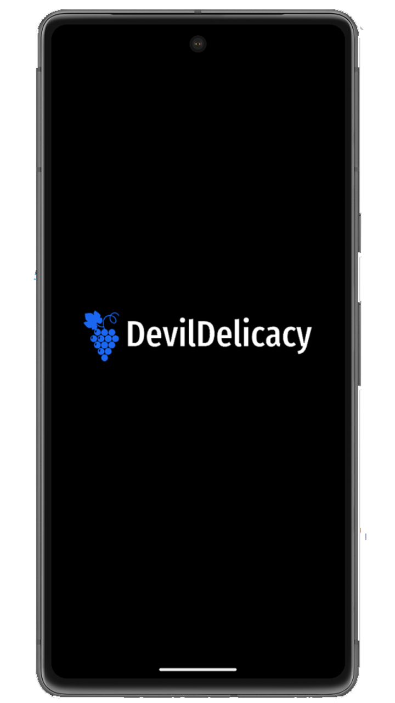
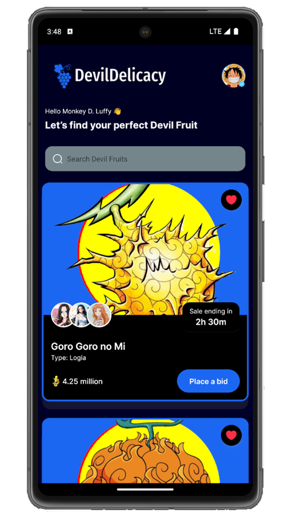
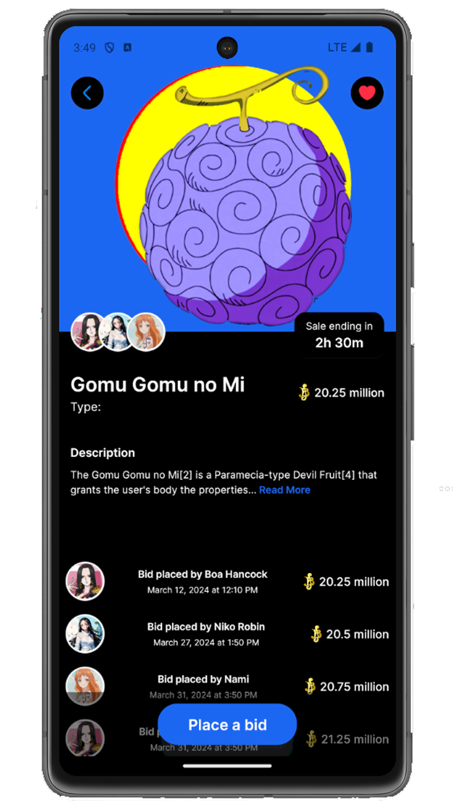

# DevilDelicacy - React Native Auction App

Welcome to DevilDelicacy, a mobile auction app built using React Native. DevilDelicacy allows users to view product listings and explore product details in an intuitive interface. This app has been developed using Expo, VS Code, and tested on Android Studio Emulator.

## Features

- **Product Listing:** View a list of available products for auction.
- **Product Detail:** Explore detailed information about each product.
- **Intuitive Interface:** User-friendly interface for seamless navigation.

## Installation

1. Clone the repository:

   ```
   git clone https://github.com/Punit-Shinde/DevilDelicacy.git
   ```

2. Navigate to the project directory:

   ```
   cd DevilDelicacy
   ```

3. Install dependencies:

   ```
   npm install
   ```

4. Run the app:

   ```
   npm start
   ```

5. Open the app in your preferred emulator or mobile device using the Expo client.

## Screenshots





## Technologies Used

- **React Native:** Framework for building native apps using React.
- **Expo:** Toolchain and platform for universal React applications.
- **VS Code:** Source code editor developed by Microsoft.
- **Android Studio Emulator:** Android emulator for testing and debugging.

## Contributing

Contributions are welcome! If you find any issues or have suggestions for improvement, feel free to open an issue or create a pull request.

## License

This project is licensed under the [MIT License](LICENSE).

